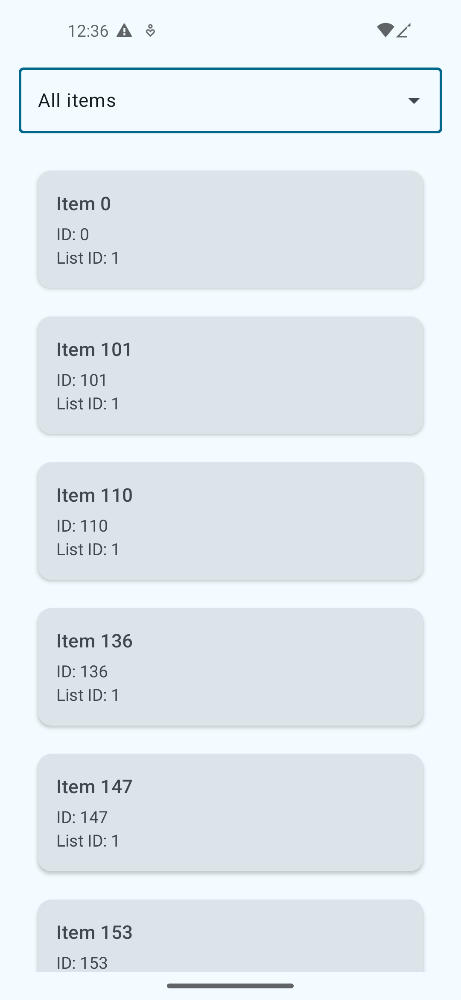
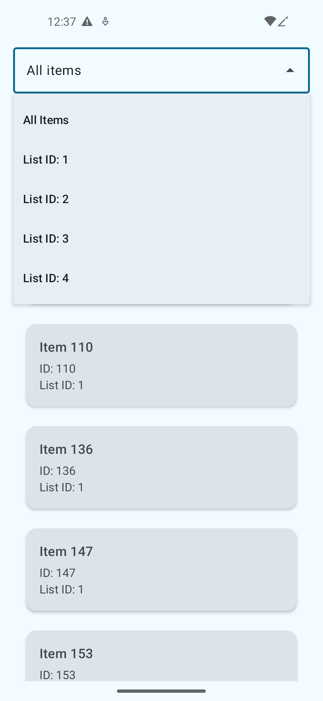
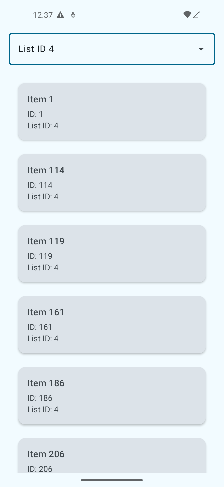

# FetchRewardsAndroid

## Problem Description

Please write a native Android app in Kotlin or Java that retrieves the data from https://fetch-hiring.s3.amazonaws.com/hiring.json.

Display this list of items to the user based on the following requirements:
- Display all the items grouped by "listId"
- Sort the results first by "listId" then by "name" when displaying.
- Filter out any items where "name" is blank or null.

The final result should be displayed to the user in an easy-to-read list.

Please make the project buildable on the latest (non-pre release) tools and supporting the current release mobile OS.

## Tech Stack

- Language: Kotlin
- UI Framework: Jetpack Compose
- Architecture: MVVM with clean architecture
- Dependency Injection: Koin
- Networking: Retrofit
- Concurrency: Coroutines & Flow
- Testing: JUnit, MockK

## Project Structure

```tree
.
├── app/src/main/java/io/github/h4rz/fetchrewardsandroid/
│   ├── data/
│   │   ├── model/
│   │   │   └── ItemDTO.kt              # Data transfer object for API response
│   │   ├── remote/
│   │   │   └── ApiService.kt           # Retrofit API service interface
│   │   └── repository/
│   │       └── ItemRepositoryImpl.kt   # Implementation of repository interface
│   ├── di/
│   │   ├── AppModule.kt              # DI module for API and Repository
│   │   └── ViewModelModule.kt        # DI module for ViewModels
│   ├── domain/
│   │   ├── model/
│   │   │   └── Item.kt                 # Domain model for business logic
│   │   └── repository/
│   │       └── ItemRepository.kt       # Repository interface
│   ├── ui/
│   │   ├── components/
│   │   │   ├── ErrorComponent.kt       # Error state component
│   │   │   ├── ItemCard.kt             # Card component for displaying items
│   │   │   ├── ListIdDropdown.kt       # Dropdown component for listId selection
│   │   │   └── Loader.kt               # Loading state component
│   │   ├── model/
│   │   │   └── ItemUIState.kt          # UI state data class
│   │   ├── screen/
│   │   │   └── ItemListScreen.kt       # Main Screen
│   │   └── viewmodel/
│   │       └── MainViewModel.kt        # ViewModel for MainScreen
│   ├── FetchRewardsAndroidApplication.kt
│   └── MainActivity.kt
└── app/src/test/java/io/github/h4rz/fetchrewardsandroid/
    ├── repository/
    │   └── ItemRepositoryTest.kt        # Tests for repository
    └── viewmodel/
        └── MainViewModelTest.kt         # Tests for ViewModel
```

## Architecture
The app follows Clean Architecture principles with a clear separation of concerns:

- Data Layer: Handles data operations and external interactions
- Domain Layer: Contains business logic and interfaces
- UI Layer: Manages UI logic and state

## Screenshots





## Testing

- Repository tests for data processing
- ViewModel tests for business logic
